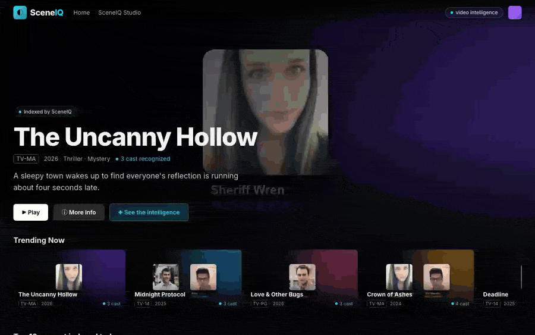
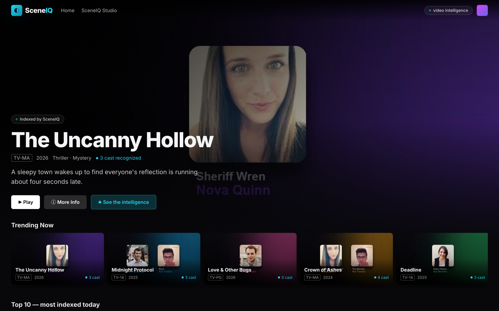
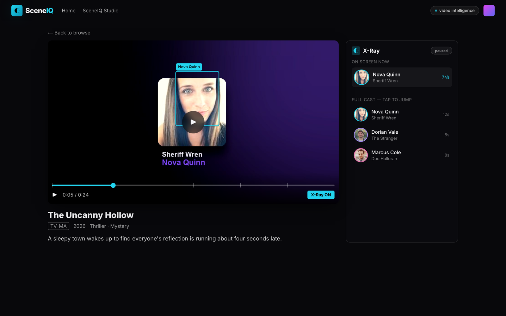
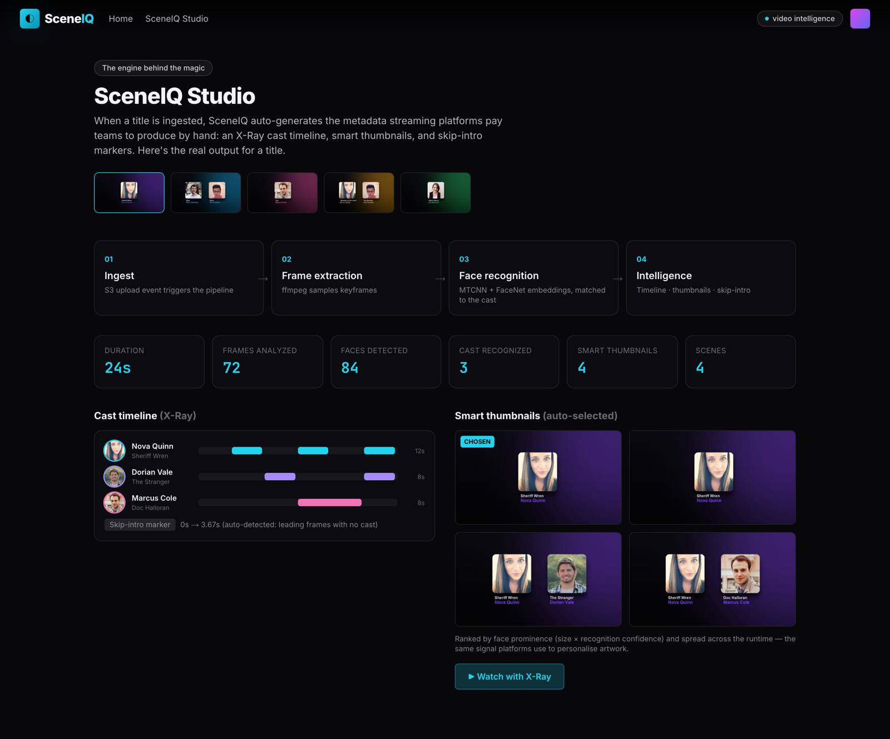

<div align="center">

# ◐ SceneIQ

### Video intelligence for streaming platforms.

SceneIQ ingests a video and automatically generates the metadata streaming
platforms spend teams producing by hand — an **X-Ray cast timeline** (who's on
screen, when), **smart thumbnails**, and **skip-intro markers**. It ships with a
**Netflix-grade viewer** so you can watch the intelligence work live: pause on
any face and SceneIQ tells you who it is.

<br/>



<br/>


<sub>▶ Prefer video? Watch the <a href="docs/media/walkthrough.mp4">full walkthrough (MP4)</a>.</sub>

</div>

---

## The problem

Every time a streaming platform ingests a title, someone (or something) has to
tag it: **who appears when**, where the **intro/recap** is, which frames make
good **thumbnails**. At catalog scale that's an enormous, recurring cost — it's
why AWS Rekognition, Google Video Intelligence, and startups like Twelve Labs
sell "video understanding" to media companies.

**SceneIQ is that engine, end to end** — plus a viewer that proves it works.

## What the pipeline produces

On ingest, SceneIQ auto-generates:

| Output | What it is |
|--------|-----------|
| 🎭 **X-Ray cast timeline** | Every recognised actor and the exact timestamps they appear — the data behind "who is this?" |
| 🖼️ **Smart thumbnails** | The best frames featuring the lead cast, ranked by face prominence × confidence |
| ⏭️ **Skip-intro markers** | Auto-detected from the leading run of frames with no cast |
| 🎬 **Scene segmentation** | Shot boundaries via frame-difference detection |

Every number in the demo is **real** — the pipeline genuinely detects and
recognises the enrolled cast in the footage (MTCNN + FaceNet/VGGFace2).

## The viewer

<table>
  <tr>
    <td width="50%"><p align="center"><sub><b>Home</b> — a streaming catalog, indexed by SceneIQ</sub></p></td>
    <td width="50%"><p align="center"><sub><b>Watch</b> — pause → X-Ray names who's on screen</sub></p></td>
  </tr>
  <tr>
    <td colspan="2"><p align="center"><sub><b>SceneIQ Studio</b> — the engine's real output: pipeline stages, cast-timeline Gantt, auto-selected thumbnails</sub></p></td>
  </tr>
</table>

- **Pause → X-Ray:** bounding boxes + names + confidence for everyone on screen.
- **Cast timeline scrubber:** tap an actor to jump to their scenes.
- **Skip Intro** that actually works, because the pipeline found the intro.

## Architecture

An event-driven, serverless pipeline — the same engine runs on your laptop and in AWS.

```
 ┌──────────────┐  upload .mp4   ┌───────────────────────────┐
 │  S3 uploads  │ ─────event───▶ │  frame-extractor  Lambda  │  (ffmpeg layer)
 └──────────────┘                │  → keyframes → S3 media    │
                                 └─────────────┬─────────────┘
                                               │ invoke
                                 ┌─────────────▼─────────────┐
                                 │   recognizer  Lambda      │  (ECR: torch+facenet)
                                 │   MTCNN + FaceNet          │
                                 │   → intelligence.json (S3) │
                                 │   → cast timeline (DynamoDB)│
                                 └─────────────┬─────────────┘
                                               ▼
                                 ┌───────────────────────────┐
                                 │  Next.js viewer (X-Ray UI) │
                                 └───────────────────────────┘
```

The whole stack is defined in [`infra/`](infra/) as Terraform (`terraform
validate` passes) — `terraform apply` provisions S3, both Lambdas, the ffmpeg
layer, ECR, DynamoDB, IAM and the S3→Lambda trigger.

## Quick start (local, no AWS)

```bash
# 1. run the pipeline: builds a demo cast, renders clips, and INDEXES them
python3 -m venv .venv && source .venv/bin/activate
pip install -r pipeline/requirements.txt
python pipeline/generate_demo.py        # writes web/public/titles/*

# 2. launch the viewer
cd web && npm install && npm run dev     # → http://localhost:3000
```

Open the app, play a title, and **pause on a face** — SceneIQ names them.
Visit **/studio** to see the raw pipeline output.

## Deploy to AWS

```bash
cd infra
terraform init
terraform apply     # provisions the serverless pipeline
# then: aws s3 cp episode.mp4 s3://sceneiq-dev-uploads/  → pipeline runs automatically
```

## Tech stack

**Pipeline** · Python · PyTorch · facenet-pytorch (MTCNN + InceptionResnetV1/VGGFace2) · OpenCV · ffmpeg
**Cloud** · AWS Lambda (zip + ECR container) · S3 · DynamoDB · ECR · Terraform
**Viewer** · Next.js 14 · TypeScript · Tailwind CSS · Framer Motion

## Project structure

```
sceneiq/
├── pipeline/                  # the video-intelligence engine
│   ├── faces.py               # MTCNN + FaceNet detection/recognition + cast index
│   ├── ingest.py              # frames → timeline · thumbnails · scenes · intro
│   ├── generate_demo.py       # builds the demo catalog (render + index)
│   └── lambda/                # thin Lambda handlers wrapping the engine
├── web/                       # Next.js Netflix-grade viewer (X-Ray, Studio)
│   └── public/titles/         # generated clips + intelligence.json + thumbnails
├── infra/                     # Terraform: serverless deploy (validated)
└── docs/media/                # walkthrough + screenshots
```

## A note on the demo content

The demo "cast" uses rights-free portrait photos and stylised generated clips, so
the repo runs out of the box with **no licensed content and no real individuals**.
The recognition itself is genuine — swap in real footage and an enrolled cast and
the same pipeline produces the same intelligence.

---

<div align="center"><sub>MIT licensed · built as a study of video understanding at streaming scale.</sub></div>
